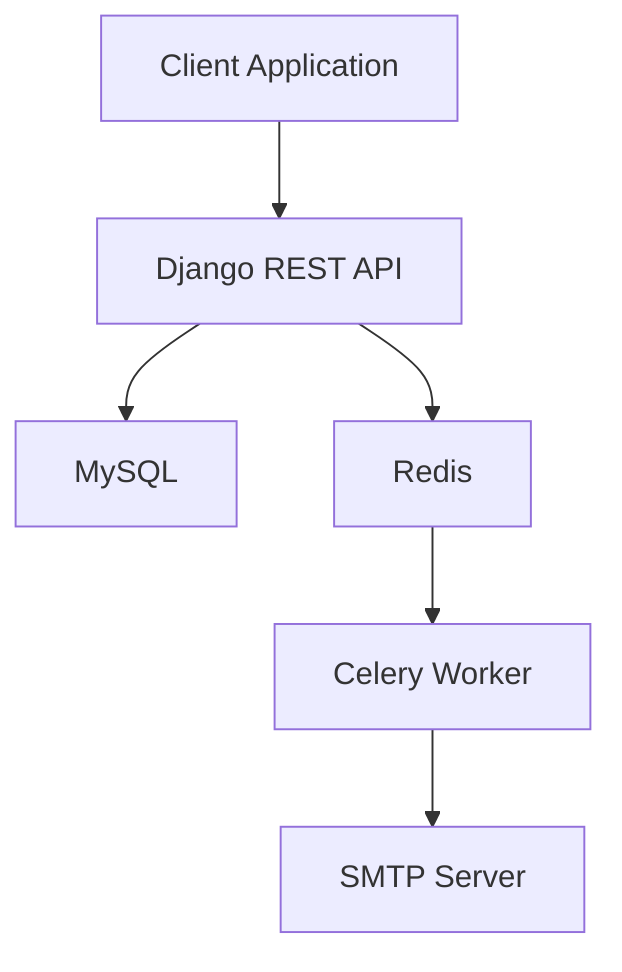
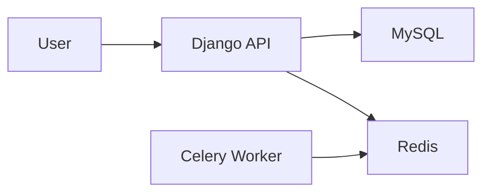

# TaskFlow

A containerized project management API built with Django REST Framework, designed for team collaboration, project organization, task tracking, and asynchronous background processing.

## Overview

TaskFlow provides a backend platform for managing teams, projects, and tasks. It supports invitation-based team management, role-based collaboration, task assignment, commenting, and asynchronous workflows powered by Celery.

The project was built with a strong focus on backend architecture, API design, containerization, and deployment readiness.

---

## Features

### Team Management

* Create and manage teams
* Invite members via email
* Role-based team collaboration

### Project Management

* Create projects within teams
* Organize work into project-specific task boards
* Track project ownership and membership

### Task Management

* Create, update, and assign tasks
* Define priorities and deadlines
* Track task ownership

### Collaboration

* Task-level commenting
* Team-based workflows
* Invitation system

### Authentication

* JWT-based authentication
* User registration and login
* Secure API access

### Background Processing

* Asynchronous email delivery using Celery
* Redis-backed task queue

---

## Architecture



---

## Tech Stack

| Category              | Technology            |
| --------------------- | --------------------- |
| Language              | Python                |
| Framework             | Django                |
| API Framework         | Django REST Framework |
| Authentication        | JWT + Djoser          |
| Database              | MySQL                 |
| Background Tasks      | Celery                |
| Message Broker        | Redis                 |
| Email Testing         | SMTP4Dev              |
| Containerization      | Docker                |
| Service Orchestration | Docker Compose        |

---

## Containerized Services

The application runs as a multi-service Docker environment.



Services are orchestrated using Docker Compose, allowing the entire development environment to be started with a single command.

---

## Running Locally

### Prerequisites

* Docker
* Docker Compose

### Clone Repository

```bash
git clone https://github.com/AmirAbbas-Mashayekhi/TaskFlow.git
cd TaskFlow
```

### Configure Environment

Create a `.env` file:

```env
DJANGO_SECRET_KEY=your_secret_key

MYSQL_ROOT_PASSWORD=root_password
MYSQL_DATABASE=taskflow
MYSQL_USER=user
MYSQL_PASSWORD=password
```

### Start Services

```bash
docker compose up --build
```

### Apply Migrations

```bash
docker compose exec backend python manage.py migrate
```

### Create Superuser

```bash
docker compose exec backend python manage.py createsuperuser
```

---

## API Capabilities

### Authentication

* User registration
* JWT login and refresh

### Teams

* Team creation
* Member invitations
* Membership management

### Projects

* Project creation
* Team-project relationships

### Tasks

* Task assignment
* Priorities
* Deadlines
* Status tracking

### Comments

* Task discussion and collaboration

---

## Future Improvements

* CI/CD pipeline with GitHub Actions
* Production deployment configuration
* Nginx reverse proxy
* API rate limiting
* Monitoring and observability
* Kubernetes deployment manifests

---

## Learning Objectives

This project was primarily built to deepen practical experience in:

* REST API design
* Authentication and authorization
* Database modeling
* Asynchronous task processing
* Docker-based development workflows
* Multi-service application architecture
* Backend system design
